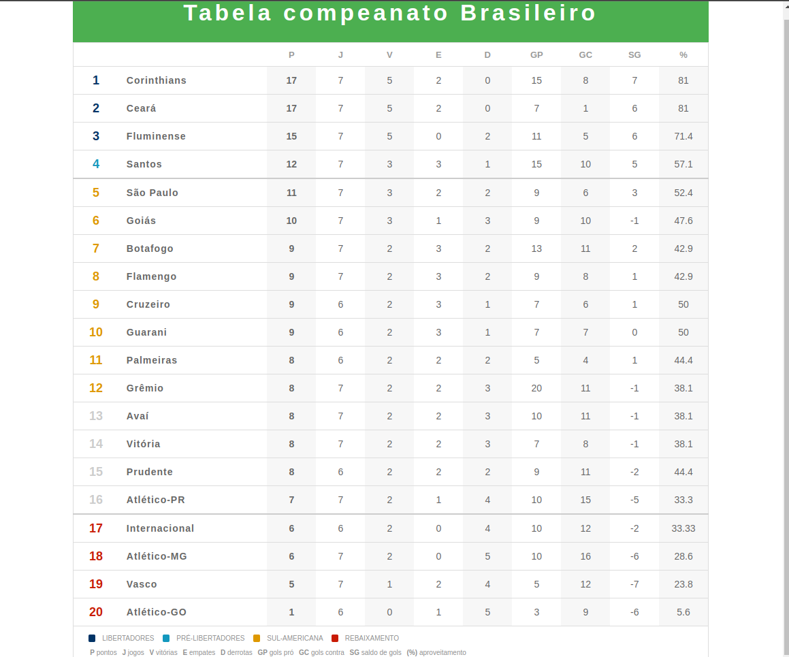

<h1 align="center"> 
   Tabela de Classificação do Campeonato
  </h1>

<h1 align="center">
  
</h1>

Tabela de classificação é uma página mostra classificação dos times, e suas zonas. Do primeiro colocado ao terçeiro **Libertadores**, quarto colocado **Pré-Libertadores**, do quinto ao décimo segundo colocado **Sul-Americana**, do décimo terçeiro ao décimo sexto não se classificam para nenhuma outra competição, do décimo setimo ao vigésimo são rebaixados.

## Tecnologias
* CSS
* HTML
* Netlify
* GitHub

## Link da aplicação
https://joyful-swan-117de2.netlify.app

## Versão
 
1.0.0.0
 
 
## Autor
 
* **Jeferson Ferreira**: @Jefersoncf (https://github.com/Jefersoncf)
 
Obrigado por me visitar e boa codificação!
